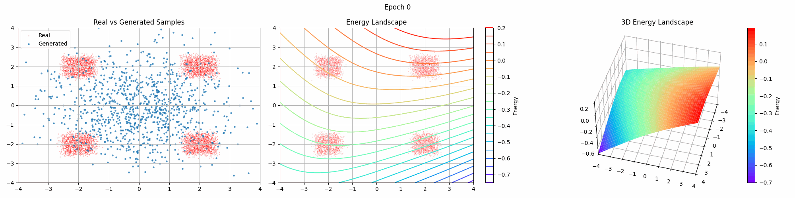

<div align="center">

<h1> Energy-based Models </h1>

</div>

This repository provides an implementation of Energy-based Models (EBMs) with various training methods, focused on learning 2D toy distributions. It implements most of the training methods from [How to Train Your Energy-Based Models](https://arxiv.org/abs/2101.03288) (Song et al. 2021).

## What are Energy-based Models?

Energy-based Models learn to assign low energy values to "real" data points and high energy values to "fake" ones. The energy function E(x) implicitly defines a probability distribution through the Boltzmann distribution:

$$ p(x) \propto \exp(-E(x)) $$

## Training Methods

### Maximum Likelihood with MCMC
Maximizes the likelihood of real data while minimizing the likelihood of samples drawn using MCMC. We implement:
- Langevin MCMC
- Hamiltonian MCMC 

### Score Matching
Directly matches the gradient of the energy function with the score function of the data distribution. We provide three variants:
- Regular Score Matching
- Denoising Score Matching 
- Sliced Score Matching

### Noise Contrastive Estimation (NCE)
Transforms the density estimation problem into a binary classification between real data and noise samples. NCE avoids MCMC sampling by using a noise distribution.

## Experiments

The repository includes experiments on learning various 2D toy distributions (e.g. 8 gaussians, 2 spirals, 4 squares).

We use a simple MLP architecture to learn the energy function. The training process visualizes:
- Real vs Generated Samples
- Energy Landscape Contours
- 3D Energy Surface

Example from training a 2-layer MLP on the 4 squares dataset using Score Matching and sampling with Hamiltonian MCMC:



## Repository Structure

```
src/ebms/
├── models/         # Energy-based model architectures
├── losses/         # Implementation of different training objectives
├── samplers/       # MCMC sampling methods
├── data/           # Toy dataset generators
└── utils/          # Visualization utilities
```

## Key Components

- Base classes define interfaces for models, losses, and samplers
- MLP implementation for energy function
- Flexible sampling with Langevin and HMC
- Various training objectives (ML-MCMC, Score Matching, NCE)
- Real-time visualization of training progress

## Installation

Any installation tool that supports `pyproject.toml` should work. 

```bash
pip install -e .
```

## Usage

See `notebooks/example.ipynb` for a simple example.

